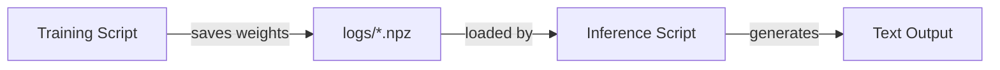

# parameter-golf Journal

A running log of the team's experiments, milestones, and learnings.

## Table of Contents

- [Apr 05, 2026](#apr-05-2026)
  - [First Training Run](#first-training-run)
  - [AI-Assisted Inference](#ai-assisted-inference)
  - [Second Run — Research-Guided Optimization](#second-run--research-guided-optimization)
  - [First GPU Run — Baseline on Sean's Runpod](#first-gpu-run--baseline-on-seans-runpod)
  - [Inference Portability — In Progress](#inference-portability--in-progress)

---

## Apr 05, 2026

### First Training Run

BK ran the first end-to-end training job on the MLX backend — a smoke test at 200 iterations with 8k-token batches. No hyperparameter tuning, just a sanity check to confirm the pipeline runs start to finish. The model saved a checkpoint to `logs/`.

### AI-Assisted Inference

After training, BK used opencode (backed by Minimax) to scaffold `inference_mlx.py` — a script that loads a checkpoint, takes a text prompt, and generates tokens with greedy or top-p sampling. The script also handles both `.npz` and quantized `.ptz` checkpoints and auto-detects model variants from the weight keys.

The first run produced entertainingly broken output: the model looped on a narrow vocabulary of words, generating confident-sounding nonsense. Expected behavior for an undertrained smoke-test model, and a useful calibration point for what "more training" actually buys.

### Concepts Introduced

The train → checkpoint → infer loop at a glance:

### Second Run — Research-Guided Optimization

BK fed the community research report from the parameter-golf scrape repo into opencode (Minimax) and asked it to use those findings to improve `train_gpt_mlx.py`. The LLM read through documented techniques — architectural tweaks, quantization strategies, training efficiency patterns — and applied relevant ones to the MLX script. The prompt explicitly flagged the cost of a wrong change: training runs take a long time, so the bar for each modification had to be high.

The resulting run completed and scored **val_bpb 2.409**. Wall-clock eval time was ~23 minutes, which underscores why careful upfront reasoning matters more here than iteration speed.

| Metric | Value |
|---|---|
| val_loss | 4.0675 |
| val_bpb | 2.4090 |

### First GPU Run — Baseline on Sean's Runpod

BK got access to Sean's Runpod instance via SSH and ran the unmodified baseline `train_gpt.py` with a single GPU, following Sean's instructions. First run on real GPU hardware.

The results put everything in perspective: the baseline on a proper GPU scored **val_bpb 1.561** vs 2.409 from the local MLX run. The gap revealed that the local MLX runs had all been smoke tests — minimal iterations, not full training jobs. The "optimized" MLX numbers weren't comparable to the GPU baseline at all.

| Metric | Value |
|---|---|
| val_loss | 2.6352 |
| val_bpb | 1.5607 |
| Peak memory | 10,317 MiB allocated / 10,382 MiB reserved |
| Model size (int8+zlib) | ~9.2 MB |
| Eval time | 55s |

With that context, BK identified the correct local training command (smear gate + bigram hash features enabled) and kicked off a proper full local run on Apple Silicon.

### Inference Portability — In Progress

The existing `inference_mlx.py` only supports MLX checkpoints. To test the GPU baseline model on Sean's Runpod, BK is extending the inference script to handle standard PyTorch checkpoints. Results pending.

### TODO

- [x] Run a real training job (more iterations, proper hyperparameters)
- [ ] Complete PyTorch inference support and test baseline model on Runpod
- [ ] Get results from the full local MLX run (smear gate + bigram hash) and compare to GPU baseline (1.561)
- [ ] Identify which specific optimizations from the research report were applied
- [ ] Try inference with temperature / top-p to see if output diversity improves
