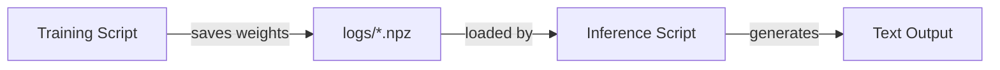

# parameter-golf Journal

A running log of the team's experiments, milestones, and learnings.

## Table of Contents

- [Apr 05, 2026](#apr-05-2026)
  - [First Training Run](#first-training-run)
  - [AI-Assisted Inference](#ai-assisted-inference)
  - [Second Run — Research-Guided Optimization](#second-run--research-guided-optimization)
  - [First GPU Run — Baseline on Sean's Runpod](#first-gpu-run--baseline-on-seans-runpod)
  - [Full Local MLX Run — Smear Gate + Bigram Hash](#full-local-mlx-run--smear-gate--bigram-hash)
  - [Inference Portability — PyTorch Script + Debugging](#inference-portability--pytorch-script--debugging)
  - [Repeating Output & Next Training Run](#repeating-output--next-training-run)
  - [K's First GPU Run — Runpod Baseline](#ks-first-gpu-run--runpod-baseline)

---

## Apr 05, 2026

### First Training Run

BK ran the first end-to-end training job on the MLX backend — a smoke test at 200 iterations with 8k-token batches. No hyperparameter tuning, just a sanity check to confirm the pipeline runs start to finish. The model saved a checkpoint to `logs/`.

### AI-Assisted Inference

After training, BK used opencode (backed by Minimax) to scaffold `inference_mlx.py` — a script that loads a checkpoint, takes a text prompt, and generates tokens with greedy or top-p sampling. The script also handles both `.npz` and quantized `.ptz` checkpoints and auto-detects model variants from the weight keys.

The first run produced entertainingly broken output: the model looped on a narrow vocabulary of words, generating confident-sounding nonsense. Expected behavior for an undertrained smoke-test model, and a useful calibration point for what "more training" actually buys.

### Concepts Introduced

The train → checkpoint → infer loop at a glance:



### Second Run — Research-Guided Optimization

BK fed the community research report from the parameter-golf scrape repo into opencode (Minimax) and asked it to use those findings to improve `train_gpt_mlx.py`. The LLM read through documented techniques — architectural tweaks, quantization strategies, training efficiency patterns — and applied relevant ones to the MLX script. The prompt explicitly flagged the cost of a wrong change: training runs take a long time, so the bar for each modification had to be high.

The resulting run completed and scored **val_bpb 2.409**. Wall-clock eval time was ~23 minutes, which underscores why careful upfront reasoning matters more here than iteration speed.

| Metric | Value |
|---|---|
| val_loss | 4.0675 |
| val_bpb | 2.4090 |

### First GPU Run — Baseline on Sean's Runpod

BK got access to Sean's Runpod instance via SSH and ran the unmodified baseline `train_gpt.py` with a single GPU, following Sean's instructions. First run on real GPU hardware.

The results put everything in perspective: the baseline on a proper GPU scored **val_bpb 1.561** vs 2.409 from the local MLX run. The gap revealed that the local MLX runs had all been smoke tests — minimal iterations, not full training jobs. The "optimized" MLX numbers weren't comparable to the GPU baseline at all.

| Metric | Value |
|---|---|
| val_loss | 2.6352 |
| val_bpb | 1.5607 |
| Peak memory | 10,317 MiB allocated / 10,382 MiB reserved |
| Model size (int8+zlib) | ~9.2 MB |
| Eval time | 55s |

With that context, BK identified the correct local training command (smear gate + bigram hash features enabled) and kicked off a proper full local run on Apple Silicon.

### Full Local MLX Run — Smear Gate + Bigram Hash

BK ran a proper full local training job with smear gate and bigram hash features enabled. The model came out worse than every prior run — **val_bpb 6.297** — and the inference output confirmed it: greedy decoding just repeats the last character or token indefinitely. Something in the feature configuration or the LLM-applied optimizations is broken for the local setup.

| Metric | Value |
|---|---|
| val_loss | 10.6326 |
| val_bpb | 6.2972 |
| Eval time | ~7 min |
| Parameters | 17,912,392 (~18M) |

The 18M parameter count is notable — much smaller than the smoke test model (80M). The LLM-applied changes likely altered the architecture in ways that introduced a configuration mismatch, or the feature flags interact badly with the current hyperparameters.

### Inference Portability — PyTorch Script + Debugging

BK wrote `inference_torch.py` to load PyTorch checkpoints from the GPU training runs. Getting it running required several rounds of LLM-assisted debugging on Runpod:

- First error: missing tokenizer file — needed to manually copy `fineweb_1024_bpe.model` into the expected path
- Once loading worked, the script ran but produced no new tokens — every prompt just echoed back verbatim
- BK's LLM traced a tensor shape mismatch deep in the `Block` forward pass: `resid_mix` (a `[2, 512]` parameter) was being indexed incorrectly, causing a broadcast failure at the residual mixing step. The fix involved correcting the indexing from treating `resid_mix` like a Python tuple to using proper tensor slicing
- Rather than patch `inference_torch.py` further, BK had the LLM write a fresh script (`inference_fresh.py`) from scratch

With the new script, the GPU model produced its first real output: *"Once upon a time, the city is a slightly different, and the city is a slightly different..."* — repetitive but structurally coherent, unlike the MLX smoke-test results.

BK also wired up the LLM to issue commands directly inside a tmux session on Runpod so it could observe and iterate in real time.

### Repeating Output & Next Training Run

Even with temperature raised to 2.0, the GPU baseline model still loops. The LLM's diagnosis: greedy decoding amplifies any bias toward high-frequency tokens, and the baseline model simply hasn't seen enough data to learn strong contextual conditioning.

BK kicked off a longer GPU training run with the official sp1024 dataset and tokenizer:

```
RUN_ID=optimized_sp1024
DATA_PATH=./data/datasets/fineweb10B_sp1024/
TOKENIZER_PATH=./data/tokenizers/fineweb_1024_bpe.model
VOCAB_SIZE=1024
TRAIN_BATCH_TOKENS=131072
ITERATIONS=5000
torchrun --standalone --nproc_per_node=1 train_gpt.py
```

Results pending.

### K's First GPU Run — Runpod Baseline

K ran their first GPU training job on a Runpod instance. Used a Claude-generated shell script to make launching the run easier. Training hit the wallclock cap at step 683/20000 (~10 minutes).

| Metric | Value |
|---|---|
| val_loss | 2.3728 |
| val_bpb | 1.4053 |
| Steps completed | 683 / 20,000 |
| Train time | 600,344 ms (~10 min) |
| Step avg | 878.98 ms |
| Peak memory | 10,317 MiB allocated / 10,574 MiB reserved |
| Model size (int8+zlib) | ~11.1 MB |
| Eval time | 30,096 ms |
| final_int8_zlib val_bpb | 1.4103 |

val_bpb of 1.4053 beats BK's earlier GPU baseline (1.561), suggesting the run configuration may already be better-tuned. Stopped early due to wallclock cap — a full run could push the score lower.

### TODO

- [x] Run a real training job (more iterations, proper hyperparameters)
- [x] Get results from the full local MLX run (smear gate + bigram hash) — val_bpb 6.297, regression
- [ ] Diagnose the regression: why did enabling smear gate + bigram hash make things worse? (architecture mismatch? LLM-applied changes broke something?)
- [x] Complete PyTorch inference support and test the GPU baseline model on Runpod — works via `inference_fresh.py`; baseline model repeats but generates tokens
- [ ] Run the official repo-recommended command on Runpod (`RUN_ID=baseline_sp1024` with 1024-vocab tokenizer) and compare to Sean's baseline (1.561)
- [ ] Port research-guided optimizations from `train_gpt_mlx.py` to `train_gpt.py` for GPU and benchmark
- [ ] Identify which specific optimizations from the research report were applied
- [ ] Try inference with temperature / top-p to see if output diversity improves
